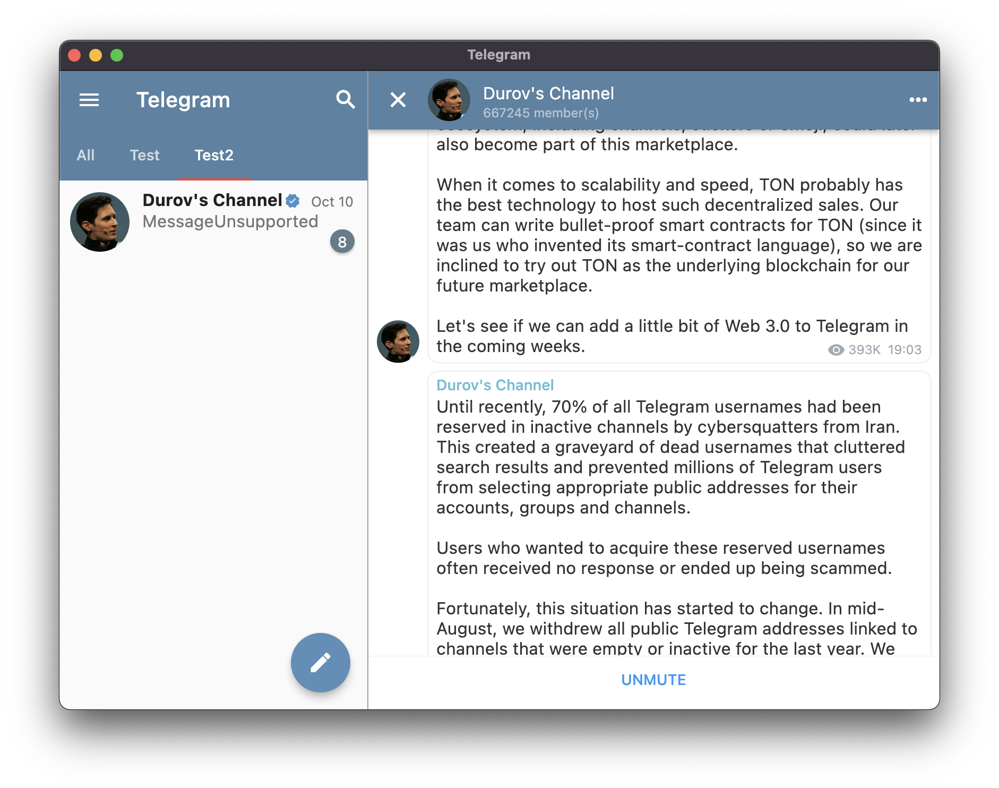

### (WIP) Telegram client written in Dart and uses Flutter.
---

Work in progress! Some code needs refactoring as it was written in haste. Somewhere left TODO and somewhere as it is. Some screens have partial functionality, because in order not to block the work, what is there is enough. For example, the authorization screen does not support password authorization. The architecture in the application is multi-modular, there are a lot of modules, this architecture has features and disadvantages. We won’t know about the disadvantages until we try it in practice!

Preferred flutter version: `stable, 3.16.3`

[TdLib](https://github.com/tdlib/td) version: `1.8.11` `1543c41`

### Supported platform
|Platform| Status|
|-|-|
|Android|✅|
|iOS|✅|
|MacOS|✅|
|Windows|✅|
|Linux|✅|
|Web|TBD|

### Getting started

1. Download prebuild TbLib for your platform from [page](https://github.com/ivk1800/td-json-client-prebuilt/releases)
2. Place binaries to `tdlib` to the repo folder:

